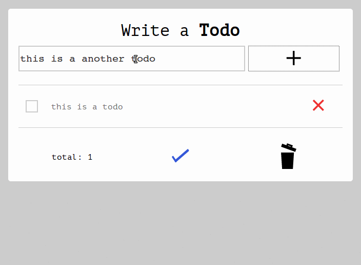

<h1 align="center">todo-app</h1>

  

It's a todo app make with pure javascript server/client side.

## Requeriments

-   [Nodejs](https://nodejs.org) and [npm](https://npmjs.org).
-   Mongodb database.

## Installation

1.  Clone the repo.
2.  Install the dependencies with `bower install && npm install`.

## Usage

You can build the assets and run the server with `npm start` or in a port specific `PORT=4001; npm start`.
